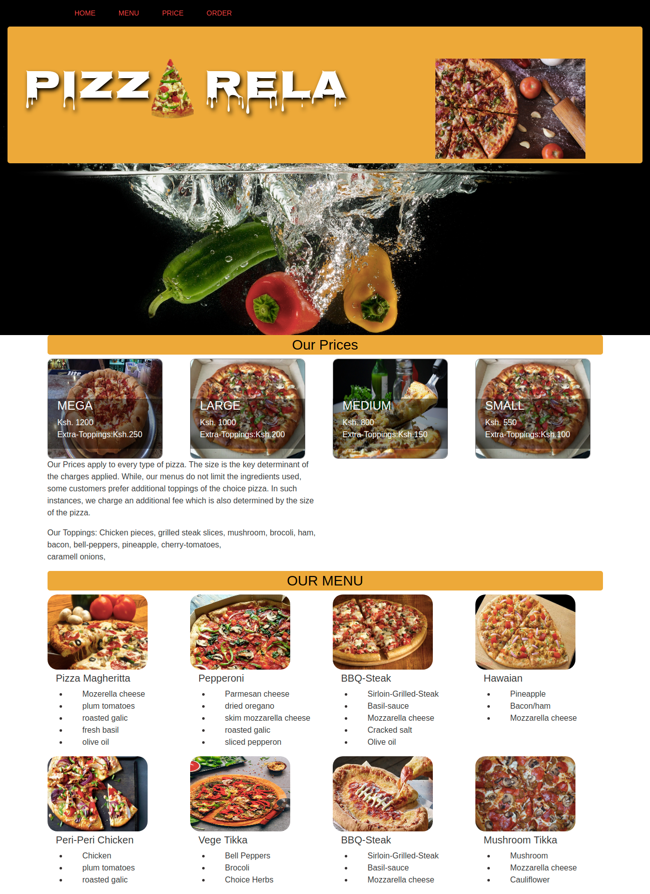

# ORDER PIZZA WEB-APP

## AUTHOR 
   Leonidah Mwamto

## DESCRIPTION
    - In this web-App the user is in a position to place an order and thereby have access to the item being sold.
    - The web-App is created using javaScript functions, constructors and prototypes.
    - On submittion of the filled form, the user is in a position to confirm the type of pizza ordered, the number, and whether or not they want it delivered to them.
    - The user also can see an alert that informs them of their order made, and the time that will be taken.

## SCREENSHOT 
   

## TECHNOLOGIES USED
    i. Bootstrap
    ii. HTML
    iii. javaScript
    iv.jQuery

## LIST OF CONTRIBUTORS
    Leonidah Mwamto

## BDD
    + This web application requires the user to input the choice of pizza.
    + Information required includes, the type of crust, the flavor, size, location if they need it delivered, the number of orders and name of client.
    + On submition of the form the client is able to see a confirmation message indicating their order preference.

## Installations
    To have this web app in your files, clone it from my github directory named project-pizza. Unzip the files within a folder suitable to you and use it as pleased.

## Licence
    MIT
    (https://choosealicense.com/licenses/mit/)